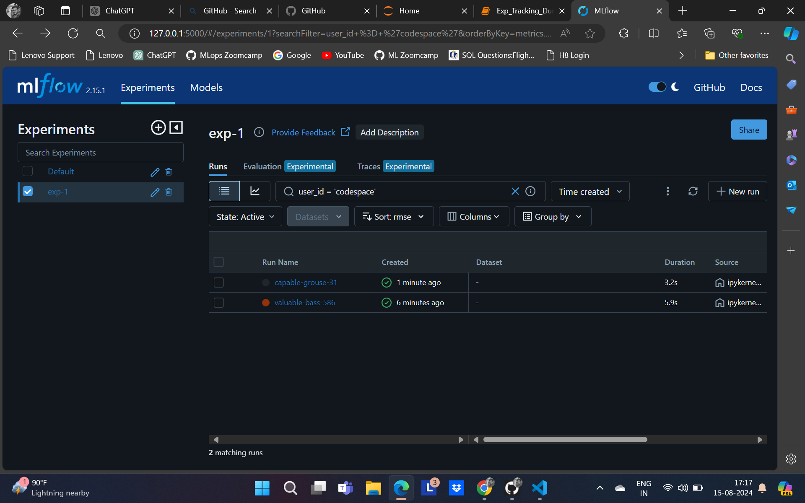
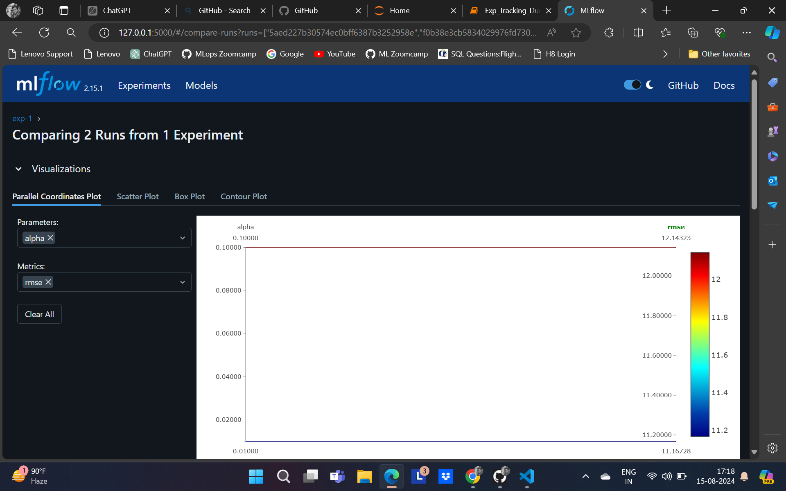
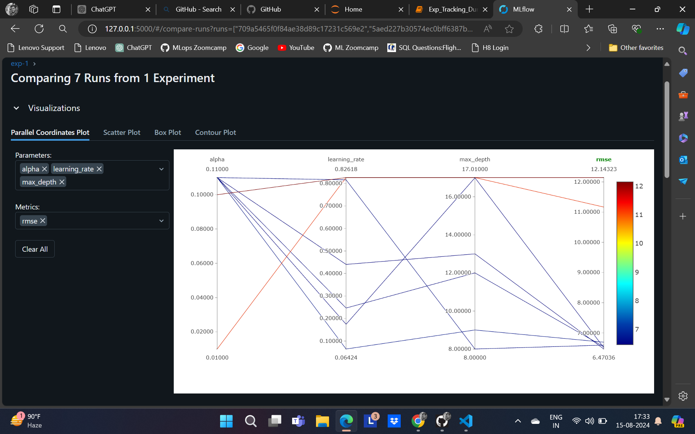
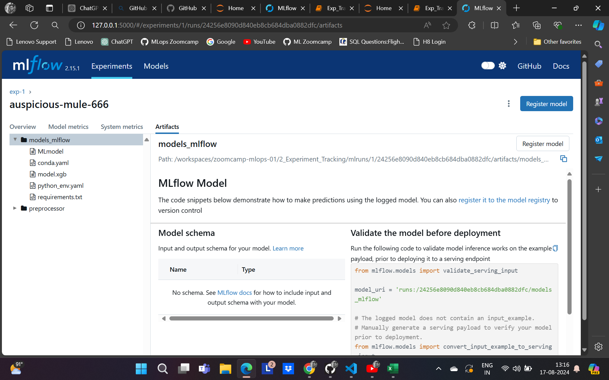

## Experiment Tracking

install necessary packages like mlflow, xgboost, hyperopts etc.

to set the backend of mlflow we need a database

for that run the following to the terminal : mlflow ui --backend-store-uri sqlite:///mlflow.db

you can see the ui here : http://127.0.0.1:5000/

mlflow.set_tracking_uri("sqlite:///mlflow.db")

mlflow.set_experiment("exp-1")

let this model worked best in terms of size, time, rmse

thwn we can register the model

