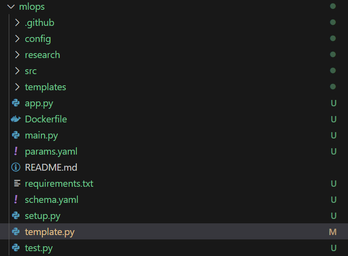

MLOps

create a [text](template.py) to create folder structure -> python template.py

.github -> for ci/cd deployment

config/config.yaml -> all configuration of project

research/trials.ipynb -> for experimenting

inside src all project component has been created

commit changes in git

inside setup.py -> drfine the local package installations

now install libraties -> pip install -r requirements.txt

push the changes to git

now inside [src/mlproject/utils/__init__.py]](src/mlproject/__init__.py) write logging functionality  -> a logging folder will be created and in case if you have any issue for deploying in cloud - you can download the code and analyze

[src/mlproject/utils/common.py](src/mlproject/utils/common.py) -> functionalities you will use frequently in the code to use

Workflows : 

1. update [config/config.yaml](config/config.yaml)

2. update [schema.yaml](schema.yaml)

3. update [params.yaml](params.yaml)

4. update entity [config_entity](src/mlproject/entity/config_entity.py)

5. update configuration manager in src config [text](src/mlproject/config/configuration.py)

6. update components 

7. update pipeline

8. update [main](main.py)

9. update [app](app.py)

in research create 

- [01_data_ingestion](research/01_data_ingestion.ipynb) for basic exploratory

- 

